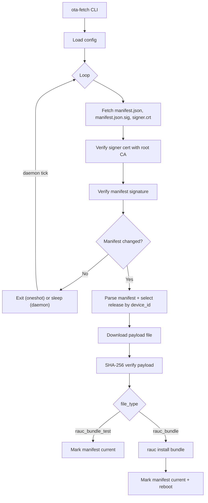

# ota-fetch

[](https://github.com/kernelforge-io/ota-fetch/actions/workflows/ci.yml)
[](LICENSE)

A lightweight C utility to fetch and verify OTA updates on embedded Linux.

## What it is

- A minimal OTA fetcher that downloads a signed manifest, verifies it, fetches
  the referenced payload, and hands off installation to RAUC.
- A C-based component intended to be embedded into Yocto/RAUC-based systems.

## What it is not

- A full update framework. It does not manage slots, update policies, or
  rollback logic. That is handled by RAUC.
- A background daemon. The "daemon" mode is a foreground polling loop. Use
  systemd or another supervisor to keep it running.

## Architecture

High-level flow (mirrors current code paths):



Key modules in `src/`:

- `main.c`: CLI parsing and startup.
- `config.c`: INI config parsing and validation.
- `ota_fetch.c`: fetch/verify/apply loop.
- `manifest.c`: manifest parsing and selection.
- `verify_libcrypto.c`: signature verification (OpenSSL).
- `hash.c`: SHA-256 helpers.

## Trust and verification model

1. **Transport security (HTTPS/mTLS)**
   - `server_url` is fetched via libcurl.
   - `ca_cert` is used to validate the HTTPS server certificate.
   - `client_cert` and `client_key` are presented for mTLS.

2. **Manifest authenticity**
   - The server must provide:
     - `manifest.json`
     - `manifest.json.sig` (raw signature bytes, not base64)
     - `signer.crt` (PEM-encoded signer certificate)
   - The signer certificate must chain to `root_ca_path` (file or hashed CA
     directory). If the chain or signature is invalid, the update is rejected.
   - Supported signer key types: Ed25519, ECDSA (SHA-256), and RSA (SHA-256).

3. **Payload integrity**
   - The payload file is verified with SHA-256 against the manifest's
     `files[0].sha256` value.

## Manifest format

- Release selection is by `device_id`, with fallback to `"default"`.
- If `device_id` is unset, the `"default"` release is used.
- The first file entry in the selected release is used for download/apply.
- Example manifests are in `test/server/manifest.json`.

Required fields used by the runtime:

- `releases[].device_id`
- `releases[].files[].file_type`
- `releases[].files[].filename`
- `releases[].files[].path`
- `releases[].files[].sha256`

Update detection is based on a SHA-256 comparison of the full manifest file
against the current manifest. The `manifest_version` field is not used to
determine whether an update is required.

## Directory layout and file lifecycle

Configured directories (defaults shown):

- `inbox_manifest_dir` (`/var/lib/ota_fetch/inbox`)
  - Downloads `manifest.json`, `manifest.json.sig`, `signer.crt`, and the
    payload file (named by `files[0].filename`).
  - Temporary downloads use a `.tmp` suffix.
- `current_manifest_dir` (`/var/lib/ota_fetch/current`)
  - Stores the active `manifest.json` after a successful update.

At the start of each run, the inbox directory is cleaned of old manifest files
and any leftover `.tmp` files. After a successful update, the manifest is moved
into the current directory; signature and cert files remain in the inbox until
the next run cleans them.

## Build

### Dependencies (Ubuntu/Debian)

```bash
sudo apt-get update
sudo apt-get install -y \
  build-essential cmake \
  libcurl4-openssl-dev libssl-dev libcjson-dev
```

### Build commands

```bash
cmake -B build -S .
cmake --build build
```

## Configuration

Default path: `/etc/ota_fetch/ota_fetch.conf`

Config is INI with `[network]` and `[system]` sections. Required keys are shown
below.

```ini
[network]
server_url = https://updates.example.com
ca_cert = /etc/ota_fetch/ca.pem
client_cert = /etc/ota_fetch/client.crt
client_key = /etc/ota_fetch/client.key
connect_timeout = 5
transfer_timeout = 30
retry_attempts = 3

[system]
update_interval_sec = 3600
inbox_manifest_dir = /var/lib/ota_fetch/inbox
current_manifest_dir = /var/lib/ota_fetch/current
root_ca_path = /etc/ota_fetch/root_ca.pem
log_file = /var/log/ota_fetch.log
device_id = my-device-id
```

Key behavior:

- `connect_timeout` and `transfer_timeout` are in seconds (0 uses libcurl
  defaults).
- `retry_attempts` controls one-shot retries (1 means a single attempt). The
  retry delay is 5 seconds between attempts.
- `update_interval_sec` is used only in daemon mode (0 uses the built-in
  3600-second default).
- `log_file` is optional; logs always go to stderr and are also appended to the
  file when set.

## Usage

```bash
./ota-fetch --oneshot
./ota-fetch --daemon
./ota-fetch --config=/path/to/ota_fetch.conf
```

## RAUC integration

When `file_type` is:

- `rauc_bundle_test`: no RAUC call; the manifest is marked current for testing.
- `rauc_bundle`: executes `rauc install <bundle_path>`, then on success moves
  the manifest to `current_manifest_dir` and triggers a reboot.

The `rauc` binary must be in the process PATH.

## Troubleshooting

Common failure modes and where they occur:

- **TLS handshake or client auth failure**: libcurl returns an error and the
  SSL verify result is logged.
- **Signature verification failure**: signer certificate does not chain to
  `root_ca_path`, or `manifest.json.sig` is invalid.
- **Manifest parse/select failure**: missing release for `device_id`, or
  required file fields are missing.
- **SHA-256 mismatch**: payload does not match `files[0].sha256`.
- **RAUC install failure**: `rauc install` exits non-zero or is terminated.

## Testing

Integration tests use a local HTTPS server with mTLS.

Dependencies:

```bash
sudo apt-get install -y jq python3 python3-pip
python3 -m pip install cryptography
```

Run the tests:

```bash
cd test/scripts
chmod +x *.sh
python3 gen_test_keys.py
./run-fetch-test.sh
```

To test different signer key types:

```bash
SIGNER_KEY_TYPE=ed25519 ./run-fetch-test.sh
```

## CI

GitHub Actions workflow: `.github/workflows/ci.yml`

- Builds with CMake
- Generates test keys
- Runs the mTLS integration test

## Documentation

Generate Doxygen HTML:

```bash
doxygen Doxyfile
```

HTML output is written to `docs/html/`.

## Contributing

See `CONTRIBUTING.md` for build and test expectations.

## Security

See `SECURITY.md` for the security reporting process.

## Project structure

```
ota-fetch/
├── src/                # Core source files
├── test/               # Integration tests and fixtures
├── docs/               # Doxygen HTML output
├── licenses/           # Third-party licenses
├── CMakeLists.txt
└── README.md
```

## License

This project is licensed under the [Apache-2.0 License](LICENSE), with third-party
components under their own terms.

See `THIRD_PARTY_NOTICES.md` and `licenses/inih-BSD-3-Clause.txt` for details.
